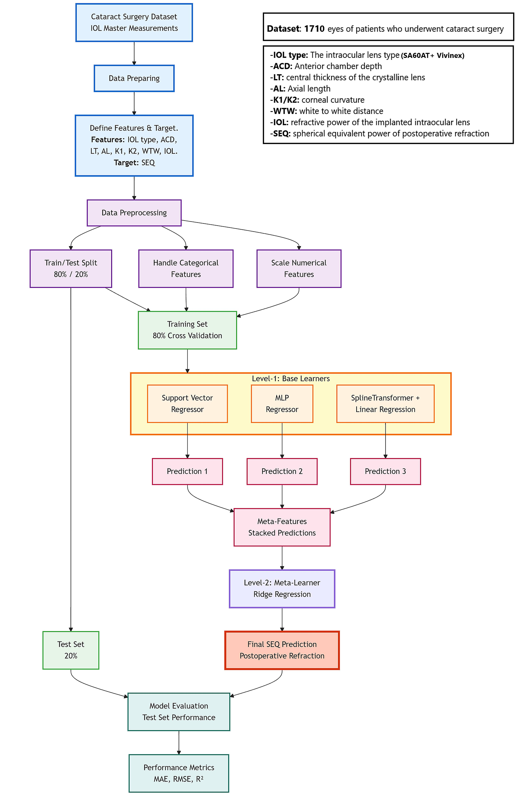

# Stacking-Ensemble-SEQ-Prediction
This repository contains the source code used for the study "Machine Learning–Based Prediction of Postoperative Refraction in Cataract Surgery: A Stacking Ensemble Approach".

## Stacking Ensemble Model
The project develops and evaluates a stacking ensemble machine learning approach designed to predict the postoperative spherical equivalent (SEQ) after Intraocular Lens (IOL) implantation in Cataract Surgery. The stacking ensemble model leverages multiple base learners to improve prediction accuracy, which is crucial in ophthalmology for better surgical outcomes.

##  Stacking Model Architecture

**Level-0 (Base Learners):**
* 1-MLPRegressor (Neural Network) 
* 2-Spline Transformer + Linear Regression
* 3-Support Vector Regressor (SVR) with RBF kernel

**Level-1 (Meta-Learner):**
The predictions from the base Learners are then combined using a Ridge regression meta-learner to produce the final prediction.

##  Key Features
* **Exploratory Data Analysis** and comprehensive correlation analysis.
* **Comprehensive Model Evaluation:** Includes train-test splits, cross-validation, bootstrap validation, Residual analysis, Error distribution, and Bland-Altman analysis.
* **Clinical Accuracy Metrics:** Evaluates predictions within ±0.25D, ±0.50D, ±0.75D, and ±1.00D thresholds.
* **Performance by Axial Length:** Stratified analysis for short, medium, and long eyes.
* **Feature Importance Analysis:** SHAP analysis to understand prediction drivers.
* **Overfitting Diagnostics:** Learning curves, residual analysis, and generalization check.
* **Optimized Hyperparameters:** Pre-tuned parameters for optimal performance.
* **Hyperparameter Optimization Script:** Ready-to-use Optuna script included for re-tuning if needed.

##  Requirements

**Runtime Environment:**
* Google Colaboratory (Recommended)
* Python 3.7+

**Libraries:**
* `scikit-learn`
* `pandas`
* `numpy`
* `matplotlib`
* `seaborn`
* `shap`
* `scipy`
* `tabulate`

**For Hyperparameter Optimization (if needed):**
* `optuna`
* `scikit-learn`
* `pandas`
* `numpy`

##  Repository Structure
* `Notebook_Stacking_Ensemble_model.ipynb`: Jupyter Notebook containing the full analysis pipeline, including data Analysis, data preprocessing, model training, evaluation results, and visualizations.
* `Stacking_Ensemble_model.py`: Python script containing the core stacking ensemble architecture for execution.
* `Optimize_Hyperparameters.py`: Hyperparameter optimization script utilizing the Optuna framework, ready-to-use for re-tuning, future re-tuning if needed.
* `Requirements.txt`: List of all Python dependencies required to reproduce the environment.
* `README.md`: This documentation file.

##  Contributors
* **M. Gabar Zeyadi**
* **Prof. Dr. Selcan Ipek-Ugay** | [ORCID: 0000-0002-4132-1199](https://orcid.org/0000-0002-4132-1199)

##  License
This project is licensed under the MIT License.
